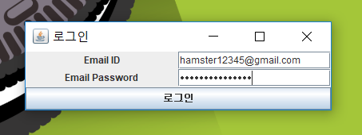
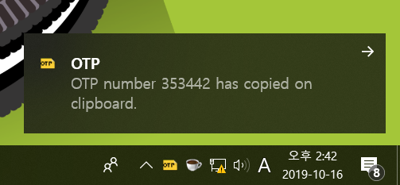

# OTP Retriever

**OTP Retriever keeps observing email inbox. When it finds out the newest OTP, copies to the clipboard. Only thing you have to do is pasting it for authentication.**

## Purpose

Using OTP Retriever, you may easily authenticate OTP as pasting OTP number instead of typing if manually. 

## Run

****

- Login to your email inbox.
- Since OTP Retriever has logged in to your email inbox, it keeps looking up your email inbox. 

****
 
- When new OTP number is found, the number would be copied on the clipboard.
- All you have to do is pasting it.


## Licence
```
MIT License

Copyright (c) 2019 Haenala Shin

Permission is hereby granted, free of charge, to any person obtaining a copy
of this software and associated documentation files (the "Software"), to deal
in the Software without restriction, including without limitation the rights
to use, copy, modify, merge, publish, distribute, sublicense, and/or sell
copies of the Software, and to permit persons to whom the Software is
furnished to do so, subject to the following conditions:

The above copyright notice and this permission notice shall be included in all
copies or substantial portions of the Software.

THE SOFTWARE IS PROVIDED "AS IS", WITHOUT WARRANTY OF ANY KIND, EXPRESS OR
IMPLIED, INCLUDING BUT NOT LIMITED TO THE WARRANTIES OF MERCHANTABILITY,
FITNESS FOR A PARTICULAR PURPOSE AND NONINFRINGEMENT. IN NO EVENT SHALL THE
AUTHORS OR COPYRIGHT HOLDERS BE LIABLE FOR ANY CLAIM, DAMAGES OR OTHER
LIABILITY, WHETHER IN AN ACTION OF CONTRACT, TORT OR OTHERWISE, ARISING FROM,
OUT OF OR IN CONNECTION WITH THE SOFTWARE OR THE USE OR OTHER DEALINGS IN THE
SOFTWARE.
```
